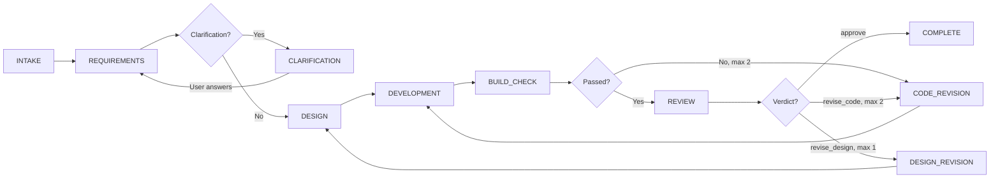

# Aegis — Virtual Software Company

Aegis is a structured multi-agent AI pipeline that generates full-stack web applications from business requirements.

## What it does

A user supplies a domain-driven configuration. The pipeline uses four agents to convert that input into:
- a finalized requirements model
- a technical design
- generated application code
- a QA review and revision cycle

## Core architecture

- Backend: Python 3.12, FastAPI, SQLite
- Frontend: Next.js 14, Tailwind CSS, shadcn/ui
- LLM: Anthropic Claude API
- Real-time: SSE for pipeline event streaming
- Generated output: self-contained Next.js apps in `backend/outputs`

## How it works

The pipeline is a state machine that orchestrates four AI agents in sequence, with built-in feedback loops for revision.

### Pipeline flow

| Phase | Agent | Output | Next Phase |
|-------|-------|--------|------------|
| INTAKE | System | Pipeline started | REQUIREMENTS |
| REQUIREMENTS | Requirements Analyst | CustomerConfigV2 or questions | CLARIFICATION or DESIGN |
| CLARIFICATION | (paused) | User answers | REQUIREMENTS |
| DESIGN | Solution Architect | TechnicalDesign | DEVELOPMENT |
| DEVELOPMENT | Developer | CodeOutput | BUILD_CHECK |
| BUILD_CHECK | System | BuildCheckResult | REVIEW or CODE_REVISION |
| REVIEW | QA Reviewer | QAReview (approve/revise) | COMPLETE, CODE_REVISION, or DESIGN_REVISION |
| CODE_REVISION | Developer | CodePatch | BUILD_CHECK (max 2 cycles) |
| DESIGN_REVISION | Solution Architect | TechnicalDesign | DESIGN (max 1 cycle) |
| COMPLETE | System | Generated files | (end) |

<details>
<summary>Alternative: Mermaid diagram (rendered on GitHub)</summary>



</details>

### Step-by-step data flow

1. **User submits requirements** — Frontend sends a Domain-Driven Configuration (DDC) to `POST /api/pipeline/start`. Backend returns a `run_id`.

2. **Frontend opens SSE stream** — Connects to `GET /api/pipeline/{run_id}/events` to receive live progress updates.

3. **Requirements Analyst** — Analyzes the DDC. If unclear, asks up to 3 rounds of clarification questions (pipeline pauses). Once finalized, produces a complete `CustomerConfigV2`.

4. **Solution Architect** — Receives the finalized DDC and produces a `TechnicalDesign` (data models, API endpoints, UI components, file structure).

5. **Developer** — Receives DDC + TechnicalDesign and generates complete application code as `CodeOutput` (a set of files).

6. **Build Checker** — Runs syntax and structural verification on the generated code. If it fails, sends back to Developer for revision (max 2 cycles).

7. **QA Reviewer** — Reviews code against requirements. Verdict:
   - `approve` → pipeline completes
   - `revise_code` → Developer fixes issues (max 2 cycles)
   - `revise_design` → Solution Architect redesigns (max 1 cycle, then falls back to code revision)

8. **Output saved** — Generated files written to `backend/outputs/{run_id}/`. Frontend fetches the manifest and displays the file tree + code preview.

9. **User launches app** — Optional: click to run `npm install && npm run dev` locally, or download as ZIP.

### Key mechanics

- **Clarification loop** — Requirements Analyst can pause the pipeline to ask questions. User answers via `POST /api/pipeline/{run_id}/clarification`, then pipeline resumes.
- **Revision cycles** — Capped at 2 code revisions and 1 design revision. Beyond the cap, partial output is accepted.
- **Patch-based updates** — On revision, Developer returns only changed files (`CodePatch`), merged with the previous output.
- **Real-time events** — Every step emits structured events via SSE. Frontend renders them as a live console log.

## Quick start

### Backend
```bash
cd backend
python -m venv venv
source venv/bin/activate
pip install -r requirements.txt
cp .env.example .env
# set ANTHROPIC_API_KEY in .env
uvicorn app.main:app --reload --port 8000
```

### Frontend
```bash
cd frontend
npm install
npm run dev
```

## Repository layout

- `backend/app` — backend application code
- `backend/tests` — backend tests
- `backend/build_sandbox` — isolated build-check sandbox for generated apps
- `backend/outputs` — generated app output directories
- `frontend` — user interface and pipeline dashboard
